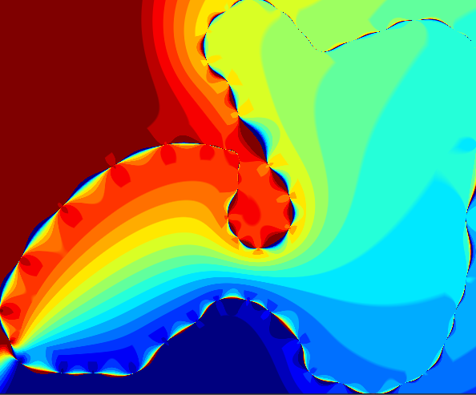

> [!CAUTION]
> This package is still under very heavy development!  Use with care.

GeometryOps.jl is a package for geometric calculations on (primarily 2D) geometries.

The driving idea behind this package is to unify all the disparate packages for geometric calculations in Julia, and make them [GeoInterface.jl](https://github.com/JuliaGeo/GeoInterface.jl)-compatible. We are focusing primarily on 2/2.5D geometries for now.  All methods in this package will consume any geometry which is compatible with GeoInterface - see its [integrations page](https://juliageo.org/GeoInterface.jl/stable/reference/integrations/) for more info on that!

Most of the use cases are driven by GIS and similar Earth data workflows, so this might be a bit specialized towards that, but methods should always be general to any coordinate space.

We welcome contributions, either as pull requests or discussion on issues!

## Methods 

GeometryOps tries to offer most of the basic geometry operations you'd need, implemented in pure Julia and accepting any GeoInterface.jl compatible type.

- General geometry methods (OGC methods): `equals`, `extent`, `distance`, `crosses`, `contains`, `intersects`, etc
- Targeted function application over large nested geometries (`apply`) and reduction over geometries (`applyreduce`)
- `signed_area`, `centroid`, `distance`, etc for valid geometries
- Line and polygon simplification (`simplify`)
- Polygon clipping, `intersection`, `difference` and `union`
- Generalized barycentric coordinates in polygons (`barycentric_coordinates`)
- Projection of geometries between coordinate reference systems using [Proj.jl](https://github.com/JuliaGeo/Proj.jl)
- Polygonization of raster images by contour detection (`polygonize`)

See the "API" page in the docs for a more complete list!

### Planned additions

- Arclength interpolation (absolute and relative)
- Buffering, hulls (convex and otherwise)
- Checks for valid geometries (empty linestrings, null points, etc) ([#14](https://github.com/asinghvi17/GeometryOps.jl/issues/14))
- Operations on spherical (non-Euclidean) geometry ([#17](https://github.com/asinghvi17/GeometryOps.jl/issues/17))
